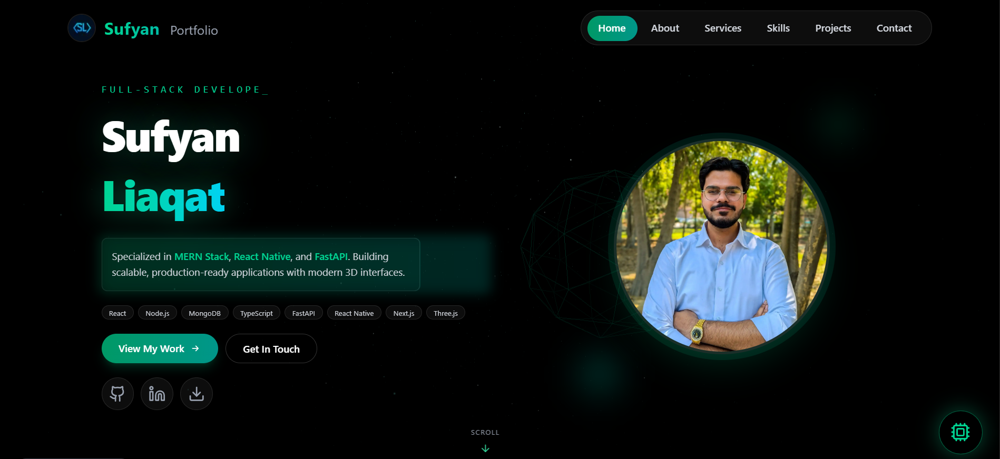

# Sufyan Liaqat — Full Stack AI Developer Portfolio

A premium, high-performance portfolio website built with **Astro 5**, **React 19**, and **Three.js**. This project features an immersive 3D background, an intelligent AI Assistant, and automated data synchronization, all while maintaining superior mobile performance.

 

## 🚀 Key Features

-   **🧠 Neural AI Assistant**: A custom-built AI interface that can navigate the site, answer questions about my skills/projects, and provide a conversational experience.
-   **✨ Immersive 3D Background**: Dynamic particle and shape system powered by **React Three Fiber**. Optimized to scale down particle counts on lower-end devices and disable entirely on mobile for peak performance.
-   **🛠️ Specialized Services**: A dedicated showcase for Full-Stack Development, AI Integration (LangChain/LangGraph), Mobile Development (React Native), and Cloud Operations.
-   **⚡ High Performance**:
    -   `content-visibility: auto` used for off-screen section rendering.
    -   Parallax and heavy blur effects selectively disabled on mobile.
    -   Optimized assets and Lighthouse-friendly architecture.
-   **🔄 Automated Knowledge Sync**: A custom script (`sync-portfolio.js`) that automatically mirrors source data from `data.js` into the AI's knowledge base (`portfolioData.json`).

## 🛠️ Tech Stack

-   **Framework**: [Astro 5.x](https://astro.build)
-   **UI Library**: [React 19](https://react.dev)
-   **Styling**: [Tailwind CSS 4.x](https://tailwindcss.com)
-   **3D Graphics**: [Three.js](https://threejs.org) via [@react-three/fiber](https://github.com/pmndrs/react-three-fiber)
-   **Icons**: [Lucide React](https://lucide.dev)
-   **Animations**: Custom CSS Animations & Framer Motion (where applicable)

## 📂 Project Structure

```text
/
├── public/                 # Static assets & AI knowledge base (portfolioData.json)
├── scripts/                # Utility scripts (sync-portfolio.js)
├── src/
│   ├── assets/             # Images and local binary files
│   ├── components/         # Reusable Astro & React components
│   ├── layouts/            # Main site templates
│   ├── lib/                # Core data and utility functions (data.js)
│   └── pages/              # Site routes (index.astro)
├── .env                    # Environment variables (API configuration)
└── package.json            # Dependencies and scripts
```

## ⚙️ Getting Started

### 1. Prerequisites
-   Node.js (LTS version)
-   Yarn or npm

### 2. Installation
```bash
git clone https://github.com/sufyan2618/astro-portfolio.git
cd astro-portfolio
yarn install
```

### 3. Environment Variables
Create a `.env` file in the root directory and add your backend API URL for the AI Assistant:
```env
PUBLIC_BACKEND_API_URL=your_backend_url_here/chat
```

### 4. Running Locally
```bash
yarn dev
```
Visit `http://localhost:4321` to see your portfolio in action.

## 🔄 Synchronizing AI Knowledge

The AI Assistant relies on a JSON version of your portfolio data. To keep it in sync with your latest changes in `src/lib/data.js`, run:

```bash
yarn sync-data
```
This script will process your JavaScript data and update `public/portfolioData.json` automatically.

## 🧞 Commands

| Command | Action |
| :--- | :--- |
| `yarn dev` | Starts local dev server at `localhost:4321` |
| `yarn build` | Build your production site to `./dist/` |
| `yarn sync-data` | **Important**: Mirrors `data.js` to AI knowledge base |
| `yarn preview` | Preview your build locally |

---

## 🤝 Contact & Connect

-   **GitHub**: [@sufyan2618](https://github.com/sufyan2618)
-   **Website**: [sufyanliaqat.me](https://sufyanliaqat.me)
-   **Inquiries**: [sufyanliaquat58@gmail.com]

Built with ❤️ by Sufyan Liaqat
